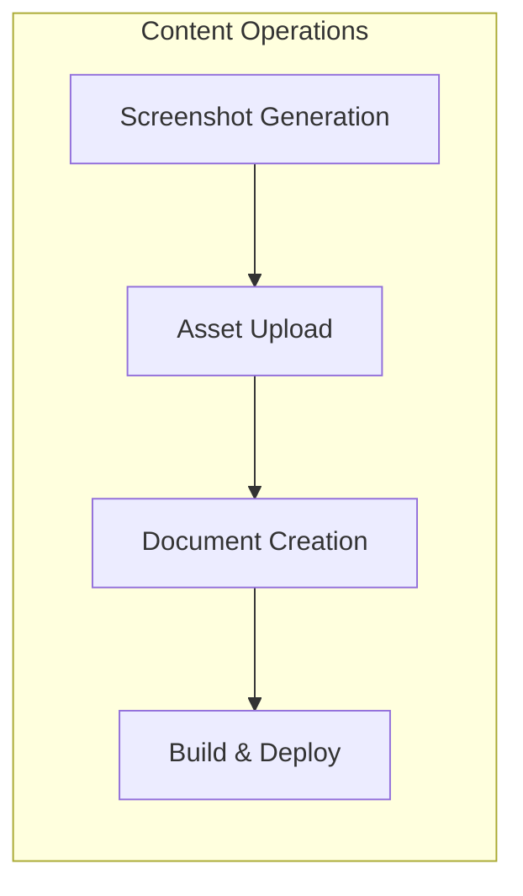

# Developer Guides

Technical guides for working with the MyWebClass project.

---

## Available Guides

| Guide | Description |
|-------|-------------|
| [Sanity Submission Scripts](./sanity-submission-scripts.md) | Automate screenshot generation and featured submission management |

---

## Quick Links

### Content Management

- [Sanity Studio](/admin) - Manage design styles, submissions, and content
- [Sanity Submission Scripts](./sanity-submission-scripts.md) - Bulk operations for gallery submissions

### Development

- [Architecture Documentation](../architecture.md) - System design and patterns
- [Sprint Artifacts](../sprint-artifacts/) - Story files and sprint tracking

---

## Guide Categories

### Content Operations

Guides for managing CMS content and media assets.

### Coming Soon

- Deployment Guide
- Testing Guide
- Contributing Guide

---

*Last updated: 2025-12-08*
