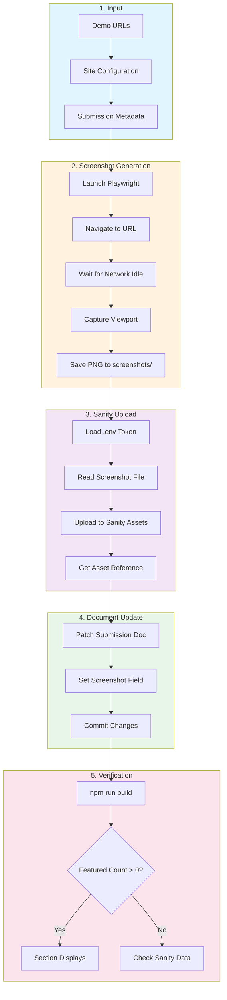

# Sanity Submission Utility Scripts

**Purpose:** Automate screenshot generation and Sanity CMS submission creation for featured gallery items.

---

## Overview

This guide covers two utility scripts created for managing gallery submissions:

| Script | Purpose |
|--------|---------|
| `scripts/generate-screenshots.mjs` | Capture viewport screenshots of live demo sites |
| `scripts/create-featured-submissions.mjs` | Upload images to Sanity and create/update submissions |

These scripts were originally created as one-time utilities but can be adapted for reusable workflows.

### Workflow Diagram



---

## Prerequisites

### Required Dependencies

```bash
# Playwright for screenshot generation
npm install playwright

# Sanity client (already in project)
npm install @sanity/client
```

### Environment Variables

Create or verify `.env` in project root:

```bash
# Sanity CMS Configuration
SANITY_PROJECT_ID=gc7vlywa
SANITY_DATASET=production
SANITY_API_TOKEN=your_write_token_here
```

**Token Permissions:** Your `SANITY_API_TOKEN` must have **Editor** or **Developer** access (read + write) to upload assets and create documents.

### Directory Structure

```
project-root/
├── .env                    # Environment variables
├── screenshots/            # Generated screenshots (gitignored)
└── scripts/
    ├── generate-screenshots.mjs
    └── create-featured-submissions.mjs
```

---

## Script 1: Screenshot Generator

### What It Does

- Launches a headless Chromium browser via Playwright
- Navigates to each configured demo URL
- Waits for network idle + animation settle time
- Captures viewport screenshot (1280×800)
- Saves PNG files to `screenshots/` directory

### Current Usage

```bash
# Ensure screenshots directory exists
mkdir -p screenshots

# Run the script
node scripts/generate-screenshots.mjs
```

### Expected Output

```
Capturing swiss-metro...
✅ Saved: /path/to/screenshots/swiss-metro-screenshot.png
Capturing deconstructivist-grunge...
✅ Saved: /path/to/screenshots/deconstructivist-grunge-screenshot.png

Done! Screenshots saved to ./screenshots/
```

### Configuration (Current)

Sites are hardcoded in the script:

```javascript
const sites = [
  {
    name: 'swiss-metro',
    url: 'https://gsinghjay.github.io/swiss_metro/',
    filename: 'swiss-metro-screenshot.png'
  },
  // ... more sites
];
```

---

## Script 2: Sanity Submission Creator

### What It Does

1. Loads environment variables from `.env`
2. Connects to Sanity with write permissions
3. Reads screenshot files from `screenshots/` directory
4. Uploads images as Sanity assets
5. Patches existing submission documents with screenshot references

### Current Usage

```bash
# Requires screenshots to exist first
node scripts/generate-screenshots.mjs

# Then upload and patch
node scripts/create-featured-submissions.mjs
```

### Expected Output

```
Token loaded: Yes
Uploading screenshots and patching submissions...

Uploading swiss-metro-screenshot.png...
✅ Uploaded: image-24f6f583487b3448c89ab2eee3adfed45570b0a2-1280x800-png
Patching Swiss Metro Transformation with screenshot...
✅ Patched: submission-swiss-metro

Done! Screenshots uploaded.

Run "npm run build" to see them on the homepage.
```

### Configuration (Current)

Submissions are hardcoded in the script:

```javascript
const submissions = [
  {
    id: 'submission-swiss-metro',
    styleRef: 'swiss-metro',
    styleName: 'Swiss Metro Transformation',
    demoUrl: 'https://gsinghjay.github.io/swiss_metro/',
    screenshotFile: 'swiss-metro-screenshot.png',
    screenshotAlt: 'Description for accessibility',
    featuredBlurb: 'Curator highlight text...',
    featuredOrder: 1,
    authenticityExplanation: 'Why this demonstrates the style...'
  }
];
```

---

## Making Scripts Reusable

### Option A: JSON Configuration File

Create a configuration file that both scripts can share:

**`scripts/submissions-config.json`**

```json
{
  "submissions": [
    {
      "id": "submission-swiss-metro",
      "name": "swiss-metro",
      "styleRef": "swiss-metro",
      "styleName": "Swiss Metro Transformation",
      "demoUrl": "https://gsinghjay.github.io/swiss_metro/",
      "screenshotAlt": "Swiss Metro design demonstration",
      "featuredBlurb": "Clean grids and purposeful typography...",
      "featuredOrder": 1,
      "authenticityExplanation": "Demonstrates Swiss design principles..."
    }
  ],
  "settings": {
    "viewport": { "width": 1280, "height": 800 },
    "screenshotDir": "../screenshots",
    "waitForAnimations": 1000
  }
}
```

**Updated Screenshot Script:**

```javascript
import { chromium } from 'playwright';
import { readFileSync } from 'fs';
import path from 'path';
import { fileURLToPath } from 'url';

const __dirname = path.dirname(fileURLToPath(import.meta.url));
const config = JSON.parse(readFileSync(path.join(__dirname, 'submissions-config.json'), 'utf8'));

async function generateScreenshots() {
  const { submissions, settings } = config;
  const browser = await chromium.launch();
  const context = await browser.newContext({ viewport: settings.viewport });

  for (const sub of submissions) {
    console.log(`Capturing ${sub.name}...`);
    const page = await context.newPage();

    try {
      await page.goto(sub.demoUrl, { waitUntil: 'networkidle', timeout: 30000 });
      await page.waitForTimeout(settings.waitForAnimations);

      const filename = `${sub.name}-screenshot.png`;
      const outputPath = path.join(__dirname, settings.screenshotDir, filename);
      await page.screenshot({ path: outputPath, fullPage: false });

      console.log(`✅ Saved: ${outputPath}`);
    } catch (error) {
      console.error(`❌ Failed: ${error.message}`);
    }

    await page.close();
  }

  await browser.close();
}

generateScreenshots();
```

### Option B: CLI Arguments

Accept parameters via command line for flexibility:

```javascript
#!/usr/bin/env node
import { chromium } from 'playwright';
import { parseArgs } from 'util';

const { values } = parseArgs({
  options: {
    url: { type: 'string', short: 'u' },
    name: { type: 'string', short: 'n' },
    width: { type: 'string', short: 'w', default: '1280' },
    height: { type: 'string', short: 'h', default: '800' },
    output: { type: 'string', short: 'o', default: './screenshots' }
  }
});

if (!values.url || !values.name) {
  console.error('Usage: node generate-screenshot.mjs -u <url> -n <name>');
  process.exit(1);
}

async function capture() {
  const browser = await chromium.launch();
  const page = await browser.newPage({
    viewport: {
      width: parseInt(values.width),
      height: parseInt(values.height)
    }
  });

  await page.goto(values.url, { waitUntil: 'networkidle' });
  await page.waitForTimeout(1000);

  const outputPath = `${values.output}/${values.name}-screenshot.png`;
  await page.screenshot({ path: outputPath });

  console.log(`✅ Saved: ${outputPath}`);
  await browser.close();
}

capture();
```

**Usage:**

```bash
node scripts/generate-screenshot.mjs \
  --url "https://example.com/demo" \
  --name "my-style" \
  --width 1920 \
  --height 1080
```

### Option C: NPM Scripts Integration

Add reusable npm scripts to `package.json`:

```json
{
  "scripts": {
    "screenshots:generate": "node scripts/generate-screenshots.mjs",
    "submissions:upload": "node scripts/create-featured-submissions.mjs",
    "submissions:full": "npm run screenshots:generate && npm run submissions:upload"
  }
}
```

**Usage:**

```bash
# Generate screenshots only
npm run screenshots:generate

# Upload to Sanity only
npm run submissions:upload

# Full workflow
npm run submissions:full
```

---

## Workflow: Adding a New Featured Submission

### Step 1: Prepare Submission Data

Add entry to configuration (if using JSON config) or edit the script directly:

```javascript
{
  id: 'submission-new-style',
  name: 'new-style',
  styleRef: 'new-style',           // Must match Sanity designStyle _id
  styleName: 'New Style Name',
  demoUrl: 'https://example.com/demo',
  screenshotAlt: 'Descriptive alt text for accessibility',
  featuredBlurb: 'Curator highlight (max 300 chars)',
  featuredOrder: 3,
  authenticityExplanation: 'Why this demonstrates the style'
}
```

### Step 2: Create Sanity Document (if new)

Import via NDJSON or create in Sanity Studio:

```bash
# Create NDJSON file
echo '{"_id":"submission-new-style","_type":"gallerySubmission","submitterName":"Your Name",...}' > studio/new-submission.ndjson

# Import
cd studio && npx sanity dataset import new-submission.ndjson production
```

### Step 3: Generate Screenshot

```bash
node scripts/generate-screenshots.mjs
```

### Step 4: Upload to Sanity

```bash
node scripts/create-featured-submissions.mjs
```

### Step 5: Verify

```bash
npm run build
# Check for "[Sanity] Fetched X featured submissions"
```

---

## Troubleshooting

### "Insufficient permissions" Error

**Cause:** API token lacks write access.

**Solution:**
1. Go to [Sanity Management Console](https://www.sanity.io/manage)
2. Select your project → API → Tokens
3. Create new token with **Editor** or **Developer** role
4. Update `.env` with new token

### "Token loaded: No"

**Cause:** `.env` file not found or malformed.

**Solution:**
- Verify `.env` exists in project root
- Check for syntax errors (no spaces around `=`)
- Ensure `SANITY_API_TOKEN` is set

### Screenshot Capture Fails

**Cause:** Site unreachable or takes too long to load.

**Solutions:**
- Increase timeout: `timeout: 60000`
- Check URL is accessible
- Verify Playwright browsers installed: `npx playwright install chromium`

### Image Not Displaying on Site

**Cause:** Sanity CDN URL malformed.

**Solution:**
- Verify `projectId` and `dataset` in image URL
- Check `card.njk` macro uses correct values
- Rebuild: `npm run build`

---

## Security Considerations

- **Never commit `.env`** - It contains your write token
- **Gitignore screenshots/** - Generated files don't belong in version control
- **Use environment-specific tokens** - Different tokens for dev/staging/production
- **Rotate tokens periodically** - Especially if exposed accidentally

---

## Future Enhancements

Consider these improvements for production use:

1. **Validation** - Verify styleRef exists before creating submission
2. **Idempotency** - Check if submission exists before creating
3. **Batch operations** - Use Sanity transactions for atomic updates
4. **Progress reporting** - Add progress bars for large batches
5. **Dry run mode** - Preview changes without executing
6. **Rollback support** - Track changes for potential undo

---

*Last updated: 2025-12-08*
